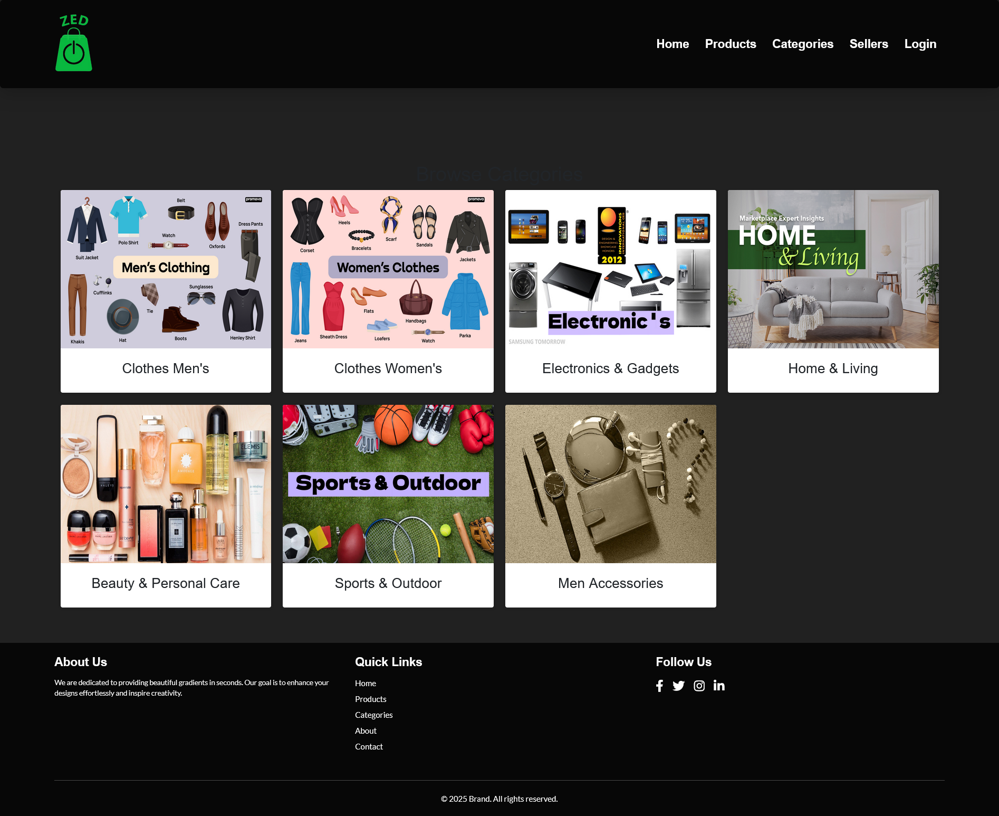

# Laravel MySQL Ecommerce Website Documentation

## Introduction
This is a Laravel-based eCommerce website that allows users to browse products, manage their cart, place orders, and authenticate using a secure login system. The admin can manage categories, products, and orders.

## Features
- User authentication (Login, Registration, Logout)
- Product listing and categories
- Shopping cart functionality
- Order management
- Admin dashboard
- Responsive UI using Bootstrap & Tailwind CSS

## Requirements
- PHP 8.x
- Laravel 11
- MySQL
- Composer
- XAMPP (or any local server)

## Installation
1. Clone the repository:
   ```bash
   git clone https://github.com/Kader1680/Ecommerce-Website-Laravel.git
   cd ecommerce-laravel
   ```

2. Install dependencies:
   ```bash
   composer install
   npm install && npm run dev
   ```

3. Configure environment:
   ```bash
   cp .env.example .env
   ```
   Update `.env` file with your database details:
   ```env
   DB_CONNECTION=mysql
   DB_HOST=127.0.0.1
   DB_PORT=3306
   DB_DATABASE=ecommerce_db
   DB_USERNAME=root
   DB_PASSWORD=
   ```

4. Run migrations and seed database:
   ```bash
   php artisan migrate --seed
   ```

5. Generate application key:
   ```bash
   php artisan key:generate
   ```

6. Start the development server:
   ```bash
   php artisan serve
   ```

## Database Structure
- Users (id, name, email, password, role)
- Products (id, name, description, price, category_id, image)
- Categories (id, name)
- Orders (id, user_id, total_price, status)
- OrderItems (id, order_id, product_id, quantity)
- Carts (id, user_id, product_id, quantity)

## Authentication
Laravel's built-in authentication system is used. To register a user:
```bash
php artisan make:auth
```

## API Routes
### Public Routes
- `GET /products` - List all products
- `GET /categories` - List all categories
- `GET /products/{id}` - View product details

### Authenticated Routes
- `POST /cart/add` - Add item to cart
- `GET /cart` - View cart
- `POST /orders/place` - Place order

## Admin Features
- Manage categories & products
- View all orders

## Contributing
Feel free to fork this repository and submit pull requests!

## Screenshots



